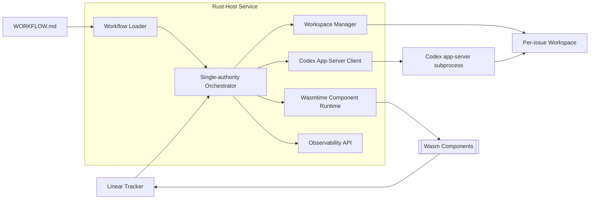

# Cadenza Architecture

## Target shape

Cadenza uses a Rust native host as the authoritative control plane and Wasmtime-hosted WebAssembly components as extension points.

## Contracts

1. `SPEC.md` from `openai/symphony` is the behavioral baseline.
2. Codex app-server generated schemas are the protocol baseline for client messages.
3. `wit/runtime.wit` is the extension ABI baseline.
4. `WORKFLOW.md` is the repository-owned runtime policy contract.

## Control-plane modules

- `cadenza-workflow`: parses and validates workflow policy.
- `cadenza-orchestrator`: owns claimed/running/retry state.
- `cadenza-workspace`: maps issue identifiers to safe per-issue directories.
- `cadenza-codex`: isolates all app-server protocol assumptions.
- `cadenza-tracker-linear`: isolates Linear GraphQL schema and normalization.
- `cadenza-wasm-host`: owns Wasmtime limits, WIT ABI checks, and capability host functions.
- `cadenza-obs`: standardizes log and metrics labels.

## Extension model

Wasm components receive only host-mediated capabilities:

- `log`
- `now-millis`
- `workspace-read`
- `http-request`
- `secret-exists`
- `linear-graphql`
- `tool-invoke`

Raw secrets are never passed into guest memory.

## Runtime policy

The MVP defaults to:

- Codex app-server over `stdio://`.
- Rust `wasm32-wasip2` for guest components.
- Wasmtime resource limits and epoch-based interruption.
- CI gates for schema drift and WIT drift.
