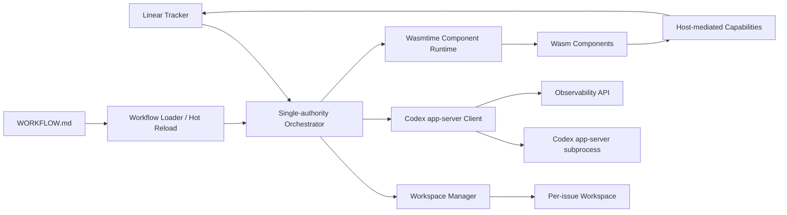

# Cadenza 可行性研究

## 结论

基于 Symphony 规范实现一个 Rust + WebAssembly 版本是可行的，但推荐目标不是“把整个 orchestrator 编译进 Wasm”，而是：

> **Rust 原生宿主负责长期运行的控制面；WebAssembly 组件模型负责受限扩展、安全沙箱和多语言工具互操作。**

这条路线和 Symphony 的服务边界更匹配。Symphony 是一个长期运行的调度/执行服务，需要读取 issue tracker、维护单一权威调度状态、创建 per-issue workspace、启动 Codex app-server、执行 retry/reconcile/stall detection、处理 hot reload，并暴露可观测性接口。这些职责天然依赖宿主级文件系统、进程管理、网络和日志系统。

## 为什么不建议一开始做纯 Wasm orchestrator

纯 Wasm orchestrator 会在以下方面遇到不必要的复杂度：

| 规范职责 | 对宿主能力的依赖 | 纯 Wasm 的问题 |
|---|---|---|
| `WORKFLOW.md` 热重载 | 文件监听、原子配置切换 | 需要宿主额外导入大量能力 |
| per-issue workspace | 路径清洗、目录 containment、跨 run 复用 | 仍需宿主管理真实文件系统 |
| Codex app-server 启动 | `bash -lc <codex.command>`、stdio/Unix socket | Wasm 组件本身不适合管理外部进程 |
| shell hooks | cwd、timeout、stdout/stderr、进程 kill | 风险边界应由 OS/container 控制 |
| single-authority scheduler | 内存状态、retry timers、running/claimed 管理 | 分散到组件会削弱一致性 |
| observability | structured logs、HTTP API、metrics | 仍应由宿主统一出口 |

因此 Cadenza 的一阶段目标应是：**Rust host first, Wasm extension second**。

## 推荐架构

### Rust Host 负责

- `WORKFLOW.md` 解析、验证、strict prompt rendering；
- hot reload 与 last-known-good 配置；
- Linear tracker 只读适配；
- issue candidate 过滤、排序、claimed/running/retry 状态机；
- workspace 创建、复用、containment 校验；
- shell hook 过渡支持；
- Codex app-server `stdio` 客户端；
- stall detection、continuation、retry/backoff、reconciliation；
- structured logs、metrics、HTTP snapshot API；
- Wasmtime 组件加载、资源限制和 host functions。

### Wasm Components 负责

- `linear_graphql` 等 agent toolchain 扩展；
- safe hook 替代高风险 shell hook；
- audit exporter / policy evaluator；
- future tracker write tools；
- 多语言插件生态。

## 技术栈可行性

| 技术 | 角色 | 工程判断 |
|---|---|---|
| Rust | 主控服务、领域模型、进程和网络层 | 成熟、适合长期运行服务和强类型状态机 |
| Tokio | 异步调度、进程管理、HTTP server | 适合 app-server stdio、HTTP observability、hot reload |
| Wasmtime | Wasm 组件运行时 | 支持 component model、WASI Preview 2、resource limits、epoch interruption |
| `wasm32-wasip2` | Rust guest component 编译目标 | 适合一阶段 Wasm 插件目标 |
| WIT | 宿主/组件接口契约 | 应作为插件 ABI 权威源 |
| `wasm-tools` | ABI 验证与 WIT 提取 | 适合 CI 中做 ABI drift gate |
| Codex app-server | Runtime coding agent protocol | 必须按精确版本和 schema hash 管理 |
| Claude Code | 开发期代码生成与审查工具 | 不建议进入生产 runtime 链路 |

## MVP 必需能力

Cadenza MVP 应优先完成以下能力：

1. `WORKFLOW.md` loader + strict prompt renderer；
2. workspace manager + path containment；
3. Linear read-only tracker adapter；
4. single-authority orchestrator 状态机；
5. Codex app-server `stdio` client；
6. retry/backoff/continuation/reconcile；
7. structured logs + `/api/v1/state`；
8. Wasmtime host + 一个最小 Wasm 插件；
9. WIT ABI gate + Codex schema gate；
10. conformance test seed。

## 主要风险

最大风险不在 Rust 或 Wasm 是否能跑，而在：

- Codex app-server 仍是实验性接口，协议可能变化；
- WIT ABI 一旦变化，插件可能拒载；
- shell hook 可能绕过沙箱；
- secrets 可能通过日志、插件或 agent 输出泄漏；
- AI 生成代码可能在不同事实基线上分叉；
- Linear GraphQL schema 或 query shape 可能漂移。

这些风险都可以通过版本冻结、CI gates、host-mediated secrets、WIT semantic versioning、conformance tests 和可观测性来缓解。
