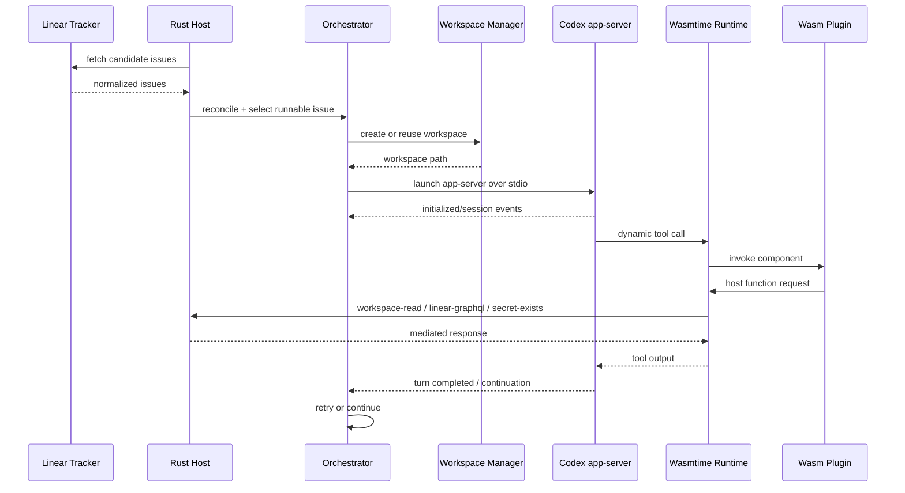

# Cadenza 初始架构

## 总体定位

Cadenza 是一个 Rust + WebAssembly 编排运行时，用于实现 Symphony-style 的 Codex 工作流：从 issue tracker 读取任务，为每个 issue 创建隔离 workspace，启动 Codex app-server session，并通过可重试、可恢复、可观测的状态机持续推进。

## crate 划分

| Crate | 职责 |
|---|---|
| `cadenza-core` | 领域模型、错误类型、配置类型、通用 traits |
| `cadenza-workflow` | `WORKFLOW.md` 解析、front matter、strict prompt rendering、hot reload |
| `cadenza-workspace` | per-issue workspace、路径清洗、containment、hook 过渡执行 |
| `cadenza-orchestrator` | single-authority scheduler、claimed/running/retry/reconcile 状态机 |
| `cadenza-codex` | Codex app-server `stdio` client、schema-bound protocol facade |
| `cadenza-tracker-linear` | Linear GraphQL read-only adapter |
| `cadenza-wasm-host` | Wasmtime runtime、WIT host functions、resource limits |
| `cadenza-obs` | HTTP API、runtime snapshot、metrics/logging helpers |
| `cadenza-cli` | CLI entrypoint、doctor、serve、dev commands |

## 数据流

## 状态模型

Cadenza host 内部应该维护唯一权威状态：

- `claimed`: 已被本轮调度保留但尚未成功运行；
- `running`: 已启动 app-server/session 的 issue；
- `retry_attempts`: 每个 issue 的重试次数；
- `retry_queue`: 等待重试的 issue；
- `runtime_snapshot`: 给观测 API 的只读投影；
- `last_known_good_workflow`: 热重载失败时继续使用的配置。

不要在多个 actor 或 worker 中分散写入这些状态。后续做执行面拆分时，可以引入 lease，但一阶段不建议。

## Workspace 安全规则

所有路径入口都必须经过：

1. identifier sanitize；
2. absolute normalization；
3. root containment；
4. symlink/parent traversal 负例测试；
5. cwd == issue workspace 校验。

任何 Wasm `workspace-read` 或未来 `workspace-write` 能力都必须复用同一套检查逻辑。

## Codex app-server 集成原则

- 默认只使用 `stdio`；
- schema artifacts 和 hash 必须落库；
- protocol mapping 集中在 `cadenza-codex`；
- event stream 与 stderr/stdout 分离处理；
- startup handshake 必须有超时；
- app-server 进程必须可 kill；
- session/turn identifiers 进入 structured logs。

## Wasm 扩展边界

Wasm 插件只能通过 host functions 与外部世界交互。host functions 应满足最小能力原则：

- `log`：结构化日志，host 自动补上下文；
- `workspace-read`：只读且 containment；
- `secret-exists`：只判断存在，不返回值；
- `http-request`：allowlist + host credential injection；
- `linear-graphql`：仅到 Linear endpoint，由 host 注入 token；
- `tool-invoke`：二次授权和 budget；
- `audit-event`：审计记录，不替代日志。

## 可观测性

一阶段至少记录：

- `poll_tick_duration`；
- `candidate_issue_count`；
- `dispatch_count`；
- `dispatch_skip_reason`；
- `running_count`；
- `retry_queue_len`；
- `stall_kill_count`；
- `codex_startup_failure_count`；
- `schema_mismatch`；
- `wit_mismatch`；
- `hook_timeout_count`；
- `secret_scrub_count`。

HTTP API 应是只读状态投影，不应成为 correctness 依赖。
